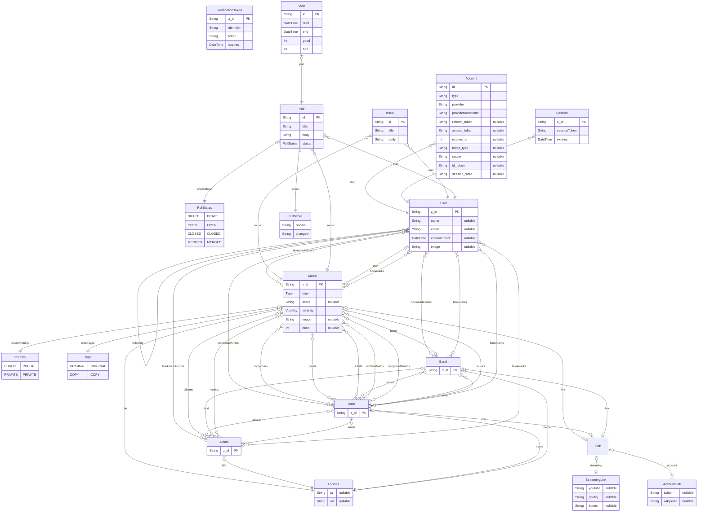

```mermaid
erDiagram

        Visibility {
            PUBLIC PUBLIC
PRIVATE PRIVATE
        }
    


        Type {
            ORIGINAL ORIGINAL
COPY COPY
        }
    


        PullStatus {
            DRAFT DRAFT
OPEN OPEN
CLOSED CLOSED
MERGED MERGED
        }
    
  Account {
    String id PK 
    String type  
    String provider  
    String providerAccountId  
    String refresh_token  "nullable"
    String access_token  "nullable"
    Int expires_at  "nullable"
    String token_type  "nullable"
    String scope  "nullable"
    String id_token  "nullable"
    String session_state  "nullable"
    }
  

  Session {
    String z_id PK 
    String sessionToken  
    DateTime expires  
    }
  

  User {
    String z_id PK 
    String name  "nullable"
    String email  "nullable"
    DateTime emailVerified  "nullable"
    String image  "nullable"
    }
  

  VerificationToken {
    String z_id PK 
    String identifier  
    String token  
    DateTime expires  
    }
  

  Music {
    String z_id PK 
    Type type  
    String score  "nullable"
    Visibility visibility  
    String image  "nullable"
    Int price  "nullable"
    }
  

  Album {
    String z_id PK 
    }
  

  Artist {
    String z_id PK 
    }
  

  Band {
    String z_id PK 
    }
  

  Issue {
    String id PK 
    String title  
    String body  
    }
  

  Pull {
    String id PK 
    String title  
    String body  
    PullStatus status  
    }
  

  Vote {
    String id PK 
    DateTime start  
    DateTime end  
    Int good  
    Int bad  
    }
  

  PullScore {
    String original  
    String changed  
    }
  

  Locales {
    String ja  "nullable"
    String en  "nullable"
    }
  

  Link {

    }
  

  StreamingLink {
    String youtube  "nullable"
    String spotify  "nullable"
    String itunes  "nullable"
    }
  

  AccountLink {
    String twitter  "nullable"
    String wikipedia  "nullable"
    }
  
    Account o{--|| User : "user"
    Session o{--|| User : "user"
    User o{--}o User : "followedBy"
    User o{--}o User : "following"
    User o{--}o Music : "bookmarkMusics"
    User o{--}o Artist : "bookmarkArtists"
    User o{--}o Band : "bookmarkBands"
    User o{--}o Album : "bookmarkAlbums"
    Music o|--|| Type : "enum:type"
    Music o|--|| Locales : "title"
    Music o|--|| Visibility : "enum:visibility"
    Music o|--|o Link : "link"
    Music o{--|o User : "user"
    Music o{--|o Band : "band"
    Music o{--}o Album : "albums"
    Music o{--}o Artist : "composers"
    Music o{--}o Artist : "lyrists"
    Music o{--}o Artist : "artists"
    Music o{--}o User : "bookmarks"
    Album o|--|| Locales : "title"
    Album o{--|o Band : "band"
    Album o{--}o Music : "musics"
    Album o{--}o Artist : "artists"
    Album o{--}o User : "bookmarks"
    Artist o|--|| Locales : "name"
    Artist o|--|o Link : "link"
    Artist o{--}o Music : "writtenMusics"
    Artist o{--}o Music : "composedMusics"
    Artist o{--}o Music : "musics"
    Artist o{--}o Band : "bands"
    Artist o{--}o Album : "albums"
    Artist o{--}o User : "bookmarks"
    Band o|--|| Locales : "name"
    Band o|--|o Link : "link"
    Band o{--}o Artist : "artists"
    Band o{--}o User : "bookmarks"
    Issue o{--|| Music : "music"
    Issue o{--|| User : "user"
    Pull ||--|| PullScore : "score"
    Pull o|--|| PullStatus : "enum:status"
    Pull o{--|| Music : "music"
    Pull o{--|| User : "user"
    Vote o|--|| Pull : "pull"
    Link o|--|o StreamingLink : "streaming"
    Link o|--|o AccountLink : "account"
```
