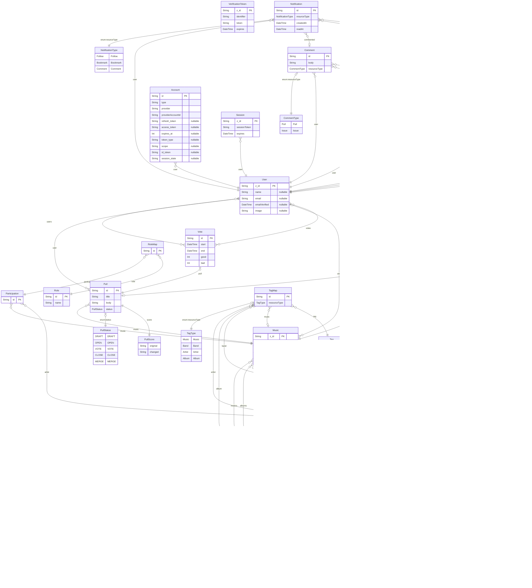

```mermaid
erDiagram

        TagType {
            Music Music
Band Band
Artist Artist
Album Album
        }
    


        BookmarkType {
            Music Music
Band Band
Artist Artist
Album Album
        }
    


        CommentType {
            Pull Pull
Issue Issue
        }
    


        NotificationType {
            Follow Follow
Bookmark Bookmark
Comment Comment
        }
    


        Visibility {
            PUBLIC PUBLIC
PRIVATE PRIVATE
        }
    


        MusicType {
            ORIGINAL ORIGINAL
COPY COPY
        }
    


        PullStatus {
            DRAFT DRAFT
OPEN OPEN
VOTE VOTE
CLOSE CLOSE
MERGE MERGE
        }
    


        IssueStatus {
            OPEN OPEN
CLOSE CLOSE
        }
    
  Account {
    String id PK 
    String type  
    String provider  
    String providerAccountId  
    String refresh_token  "nullable"
    String access_token  "nullable"
    Int expires_at  "nullable"
    String token_type  "nullable"
    String scope  "nullable"
    String id_token  "nullable"
    String session_state  "nullable"
    }
  

  Session {
    String z_id PK 
    String sessionToken  
    DateTime expires  
    }
  

  User {
    String z_id PK 
    String name  "nullable"
    String email  "nullable"
    DateTime emailVerified  "nullable"
    String image  "nullable"
    }
  

  Follow {
    String z_id PK 
    }
  

  VerificationToken {
    String z_id PK 
    String identifier  
    String token  
    DateTime expires  
    }
  

  Music {
    String z_id PK 
    MusicType type  
    String score  "nullable"
    Visibility visibility  
    Int price  "nullable"
    }
  

  Album {
    String z_id PK 
    }
  

  Artist {
    String z_id PK 
    }
  

  Band {
    String z_id PK 
    }
  

  Issue {
    String id PK 
    String title  
    String body  
    IssueStatus status  
    }
  

  Pull {
    String id PK 
    String title  
    String body  
    PullStatus status  
    }
  

  Vote {
    String id PK 
    DateTime start  
    DateTime end  
    Int good  
    Int bad  
    }
  

  Comment {
    String id PK 
    String body  
    CommentType resourceType  
    }
  

  Bookmark {
    String id PK 
    BookmarkType resourceType  
    }
  

  Participation {
    String id PK 
    }
  

  Role {
    String id PK 
    String name  
    }
  

  RoleMap {
    String id PK 
    }
  

  Tag {
    String id PK 
    String name  
    }
  

  TagMap {
    String id PK 
    TagType resourceType  
    }
  

  Notification {
    String id PK 
    NotificationType resurceType  
    DateTime createdAt  
    DateTime readAt  
    }
  

  PullScore {
    String original  
    String changed  
    }
  

  Locales {
    String ja  "nullable"
    String en  "nullable"
    }
  

  LinkList {

    }
  

  StreamingLink {

    }
  

  AccountLink {
    String twitter  "nullable"
    String wikipedia  "nullable"
    }
  

  Link {
    String id  "nullable"
    }
  

  Image {

    }
  

  ImageSize {
    String small  "nullable"
    String medium  "nullable"
    String large  "nullable"
    }
  
    Account o{--|| User : "user"
    Session o{--|| User : "user"
    User o{--}o Vote : "votes"
    Follow o{--|| User : "follower"
    Follow o{--|| User : "following"
    Music o|--|| MusicType : "enum:type"
    Music o|--|| Locales : "title"
    Music o|--|| Visibility : "enum:visibility"
    Music o|--|o LinkList : "link"
    Music o{--|o User : "user"
    Music o{--|o Band : "band"
    Music o{--}o Album : "albums"
    Album o|--|| Locales : "title"
    Album o{--|o Band : "band"
    Album o{--}o Music : "musics"
    Album o{--}o Artist : "artists"
    Artist o|--|| Locales : "name"
    Artist o|--|o LinkList : "link"
    Artist o{--}o Band : "bands"
    Artist o{--}o Album : "albums"
    Band o|--|| Locales : "name"
    Band o|--|o LinkList : "link"
    Band o{--}o Artist : "artists"
    Issue o|--|| IssueStatus : "enum:status"
    Issue o{--|| Music : "music"
    Issue o{--|| User : "user"
    Pull ||--|| PullScore : "score"
    Pull o|--|| PullStatus : "enum:status"
    Pull o{--|| Music : "music"
    Pull o{--|| User : "user"
    Vote o|--|| Pull : "pull"
    Vote o{--}o User : "users"
    Comment o{--|o Pull : "pull"
    Comment o{--|o Issue : "issue"
    Comment o{--|| User : "user"
    Comment o|--|| CommentType : "enum:resourceType"
    Bookmark o{--|o Music : "music"
    Bookmark o{--|o Band : "band"
    Bookmark o{--|o Album : "album"
    Bookmark o{--|o Artist : "artist"
    Bookmark o{--|| User : "user"
    Bookmark o|--|| BookmarkType : "enum:resourceType"
    Participation o{--|| Artist : "artist"
    Participation o{--|| Music : "music"
    RoleMap o{--|| Role : "role"
    RoleMap o{--|| Participation : "participation"
    TagMap o{--|| Tag : "tag"
    TagMap o{--|o Music : "music"
    TagMap o{--|o Band : "band"
    TagMap o{--|o Album : "album"
    TagMap o{--|o Artist : "artist"
    TagMap o|--|| TagType : "enum:resourceType"
    Notification o{--|o Bookmark : "bookmarked"
    Notification o{--|o Follow : "followed"
    Notification o{--|o Comment : "commented"
    Notification o{--|| User : "user"
    Notification o|--|| NotificationType : "enum:resurceType"
    LinkList o|--|o StreamingLink : "streaming"
    LinkList o|--|o AccountLink : "account"
    StreamingLink o|--|o Link : "youtube"
    StreamingLink o|--|o Link : "spotify"
    StreamingLink o|--|o Link : "itunes"
    Link o|--|o Image : "image"
    Image o|--|o ImageSize : "size"
```
